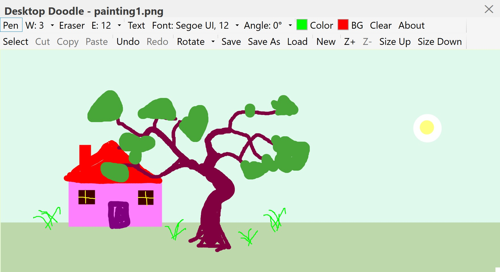
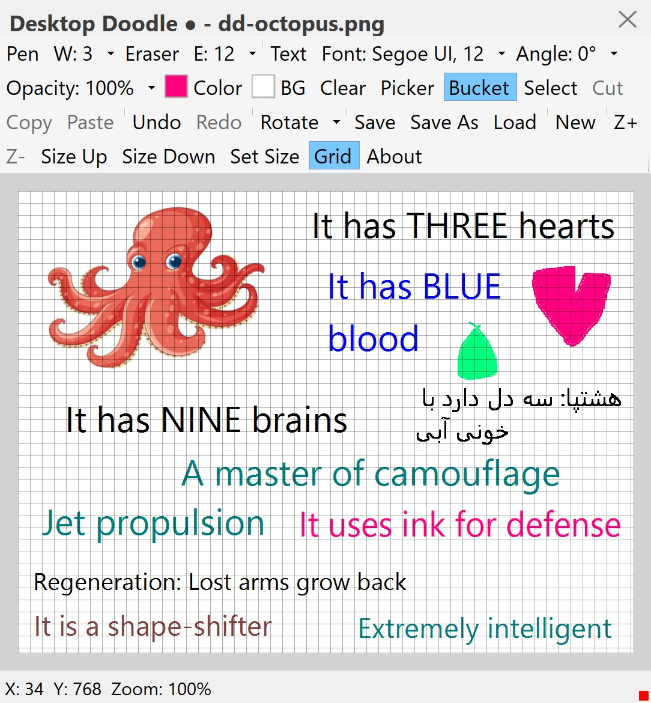
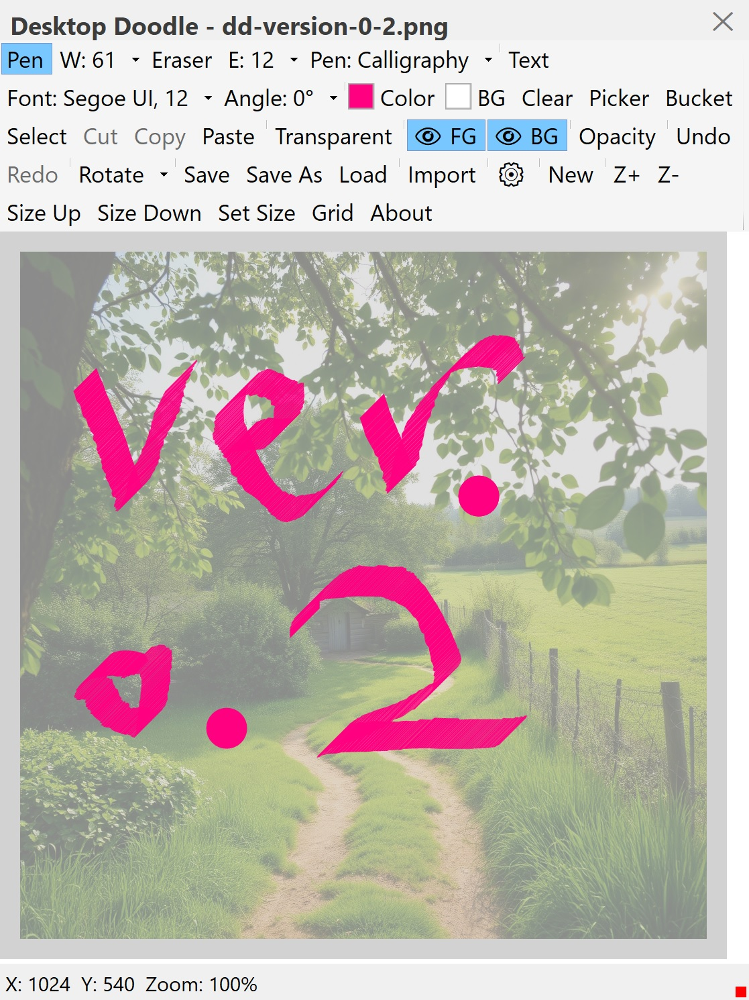

# Desktop Doodle 🎨🖌️
**Version 0.2 – Your always-on-top sketchpad**

**Desktop Doodle** is a lightweight, floating, always‑on‑top sketchpad for Windows.  
Draw, erase, type text (it now supports RTL languages too), and edit images with a clean, custom‑styled interface.  
Designed for quick notes, annotations, mockups, or just doodling over your desktop.

Desktop doodle works in two modes:
 - **Freehand**: just click and drag as always.
 - **Straight line**: hold `Shift` while dragging. You'll see a dashed preview, and when you release, a solid straight line is drawn from the start point to the end point.
 - This feature works with both Pen and Eraser.
---

<table>
  <tr>

<td>
Figure 1: A snapshot of the app: DesktopDoodle, version 0.0, while painting.</td>
    
<td>
Figure 2: A snapshot of the new version of the app: DesktopDoodle, version 0.1, while defining data pipeline.</td>

  </tr>
<tr>
<td>
Figure 3: A snapshot of the app: DesktopDoodle, version 0.2, while painting with lots of pens, two layers, and import.</td>
</tr>
</table>

---

## ✨ What's New in Version 0.2

- 🖊️ **12 Professional Pens** – Pencil, Calligraphy, Highlighter, Pixel, Airbrush, Chalk, Watercolor, Glitter, Ink, Pattern, Smudge, and Eraser – all refined and polished.
- 📋 **Improved Clipboard** – Copy and paste with external apps (Paint, etc.) while preserving transparency.
- 🎯 **Selection Tools** – Select All (`Ctrl+A`) and Content-Aware Selection (`Ctrl+Shift+A`).
- 📐 **Layer Enhancements** – Foreground/Background layers with opacity controls.
- ⚡ **Performance** – Zoom cache improvements for smoother drawing.
- 🧽 **Enhanced Eraser** – Works seamlessly on both layers (transparent on foreground, solid on background).
- 🔄 **Undo/Redo** – Fully layer-aware for all drawing and editing actions.
- 🚀 **Single-File Publish** – No extra DLLs; everything is embedded in one `.exe`.

---

## 🎨 Features

### 🖊️ Drawing Tools

| Pen | Description |
|-----|-------------|
| **Pencil** | Classic, smooth, everyday sketching. |
| **Calligraphy** | Elegant, angle‑sensitive strokes. |
| **Highlighter** | Soft, translucent, semi‑transparent. |
| **Pixel** | Retro, crisp, blocky pixel art. |
| **Airbrush** | Soft, misty, spray‑style. |
| **Chalk** | Dusty, organic, textured. |
| **Watercolor** | Fluid, blooming, fading gently. |
| **Glitter** | Sparkly, playful, shimmering. |
| **Ink** | Speed‑sensitive, flowing fountain pen style. |
| **Pattern** | Motifs: Circle, Star, Heart, Spiral, Triweave, Petal. |
| **Smudge** | Soft, blending, finger‑painting style. |
| **Eraser** | Clears to transparency or canvas colour. |

### 🎯 Selection & Editing

- **Select, Move, Resize, Rotate** – Full control over selections.
- **Cut, Copy, Paste** – With transparency support.
- **Select All** – `Ctrl+A` selects the entire canvas.
- **Content-Aware Selection** – `Ctrl+Shift+A` selects only painted pixels.
- **Arrow Keys** – Move selection by 1px (`Shift+Arrow` = 10px).
- **Delete** – Clears selection content.

### 📐 Layers

- **Foreground Layer** – Transparent by default, for main drawing.
- **Background Layer** – Solid colour, for canvas texture.
- **Visibility Toggles** – Show/hide each layer.
- **Opacity Controls** – Independent sliders for each layer.

### 🔄 Undo / Redo

- Fully layer‑aware.
- Supports all drawing and editing actions.
- Keyboard shortcuts: `Ctrl+Z` / `Ctrl+Y`.

### 🖼️ File Support

| Format | Save | Load | Import |
|--------|------|------|--------|
| PNG    | ✅   | ✅   | ✅     |
| JPEG   | ✅   | ✅   | ✅     |
| BMP    | ✅   | ✅   | ✅     |
| GIF    | ✅   | ✅   | ✅     |
| TIFF   | ✅   | ✅   | ✅     |
| SVG    | ❌   | ❌   | ✅     |

### 🖥️ UI Features

- **Custom Title Bar** – Drag to move, close button.
- **Tray Icon** – Show, New, Clear, Save, Exit.
- **Floating Panels** – Pen Settings and Layer Opacity.
- **Zoom / Pan** – Smooth and stable.
- **Grid** – Toggle on/off.
- **Status Bar** – Shows cursor position and zoom level.

---

## ⌨️ Keyboard Shortcuts

| Shortcut | Action |
|----------|--------|
| `Ctrl+O` | Load Image |
| `Ctrl+Shift+F` | Float Selection |
| `Ctrl+Z` | Undo |
| `Ctrl+Y` | Redo |
| `Ctrl+C` | Copy Selection |
| `Ctrl+X` | Cut Selection |
| `Ctrl+V` | Paste |
| `Ctrl+A` | Select All |
| `Ctrl+Shift+A` | Select Content Bounds |
| `Delete` | Clear Selection Content |
| `Escape` | Clear Selection |
| `Arrow Keys` | Move Selection (1px) |
| `Shift+Arrow` | Move Selection (10px) |
| `Ctrl+Arrow` | Rotate Selection (5°) |
| `Ctrl+R` | Rotate Selection (90°) |

---

## This archive includes the executable program: **DesktopDoodle.exe**, which is suitable for **Windows 10** and over. You should click on the executable to run.
[Download the archive for win64](https://drive.google.com/file/d/1rd8LzebpUo5rEMOaezMhSNjJ0xczfeg3/view?usp=sharing)
---
