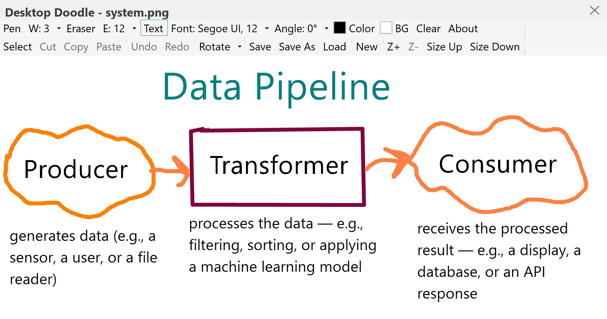

# 🖌️ Desktop Doodle

**Desktop Doodle** is a lightweight, floating, always‑on‑top sketchpad for Windows.  
Draw, erase, type text, and edit images with a clean, custom‑styled interface.  
Designed for quick notes, annotations, mockups, or just doodling over your desktop.

Desktop doodle works in two modes:
 - **Freehand**: just click and drag as always.
 - **Straight line**: hold `Shift` while dragging. You'll see a dashed preview, and when you release, a solid straight line is drawn from the start point to the end point.
 - This feature works with both Pen and Eraser.
---

## ✨ Features

- 🖊️ **Pen** – draw with variable width and colour.
- 📐 **Straight lines** – hold `Shift` while dragging to draw a perfectly straight line.
- 🧹 **Eraser** – erase with adjustable size.
- ✏️ **Text** – add and rotate text with custom font, size, and colour.
- 📦 **Select / Cut / Copy / Paste** – move, copy, or crop portions of the canvas.
- 📂 **Load Image** – open PNG, JPG, BMP, or GIF files (cropped to canvas size).
- 💾 **Save / Save As** – export to PNG, JPEG, or BMP.
- 🆕 **New Canvas** – start fresh, with prompt to save changes.
- ↩️ **Undo / Redo** – up to 20 undo steps.
- 🖼️ **Zoom** – zoom in/out (0.25x increments) for fine detail.
- 🎨 **Custom Colours** – pen and background colours with persistent custom palettes.
- 🔄 **Flip & Rotate** – horizontal, vertical, and 180° rotation.
- 🔝 **Always on Top** – stays above other windows (toggle via tray icon).
- 🧩 **System Tray** – quick access to show, clear, or exit.
---

## 🖥️ Usage

- **Move the window** – drag the title bar.
- **Resize** – drag the bottom‑right corner grip.
- **Hide** – click the ✕ button (app minimises to system tray).
- **Show** – double‑click the tray icon or use the tray menu.

### Drawing

- Select a tool from the toolbar (Pen, Eraser, Text, Select).
- Click and drag on the canvas.
- For **text**: click where you want the text, type, and press `Enter` (or `Shift+Enter` for new lines). Move/resize the text box using the grip in the bottom‑right corner.

### Selection

- Use the **Select** tool to drag a rectangle.
- Use **Cut** / **Copy** / **Paste** to modify the selection.
- Drag the selected area to move it.

### Keyboard Shortcuts

| Keys | Action |
|------|--------|
| `Ctrl+Z` | Undo |
| `Ctrl+Y` | Redo |
| `Enter` | Commit text (when typing) |
| `Esc`   | Cancel text input |
| `Shift + Drag` | Draw a straight line (Pen / Eraser) |
---

## This archive includes the executable program: **DesktopDoodle.exe**, which is suitable for **Windows 10** and over. You should click on the executable to run.
[Download the archive for win64](https://drive.google.com/file/d/1MfThIjAY1pfRS2ZUXb1tQy_FyTQBHdUP/view?usp=sharing)
---

<table>
  <tr>

<td>
Figure 1: A snapshot of the app: DesktopDoodle, version 0.0, while counting down.</td>
    
<td>
Figure 2: Another snapshot of the app: DesktopDoodle, version 0.0, when alarming.</td>

  </tr>
</table>

## 🖼️ Screenshots

---
