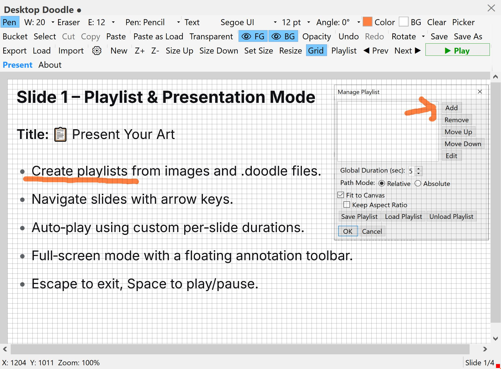

# Desktop Doodle 🎨🖌️
Desktop Doodle **0.4** brings a major leap in text handling and creative expression. You can now add fully editable **slide text boxes** with rich formatting — bold, italic, underline, strikeout, colors, highlights, sub/superscript, alignment, bullets, numbering, and full RTL support for Persian, Arabic, and etc. A vibrant emoji picker inserts true-color, scalable emojis directly into text, while an expanded symbol picker provides Greek letters, math symbols, and arrows. Editing is smoother with cut/copy/paste, independent undo/redo, and keyboard shortcuts like `Ctrl+]` / `Ctrl+[` for font size. The bucket tool and RTL formatting have been hardened for stability.

**Desktop Doodle** is a lightweight, floating, always‑on‑top sketchpad for Windows.  
Draw, erase, type text (it now supports RTL languages too), and edit images with a clean, custom‑styled interface.  
Designed for quick notes, annotations, mockups, or just doodling over your desktop.

Desktop doodle works in two modes:
 - **Freehand**: just click and drag as always.
 - **Straight line**: hold `Shift` while dragging. You'll see a dashed preview, and when you release, a solid straight line is drawn from the start point to the end point.
 - This feature works with both Pen and Eraser.
---

<table>
  <tr>

<td>
Figure 1: A snapshot of the app: DesktopDoodle, version 0.0, while painting.</td>
    
<td>
Figure 2: A snapshot of the new version of the app: DesktopDoodle, version 0.1, while defining data pipeline.</td>

  </tr>
<tr>
<td>
Figure 3: A snapshot of the app: DesktopDoodle, version 0.2, while painting with lots of pens, two layers, and import.</td>

<td>
Figure 3: A snapshot of the app: DesktopDoodle, version 0.3, while showing the new presentation mode.</td>
</tr>
</table>

---

## 🎉 What’s New in Desktop Doodle 0.4

### 🧾 Slide Text Boxes – A New Level of Rich Text
- Add draggable, resizable text boxes directly on the canvas.
- Full rich text support:
  - Bold, italic, underline, strikeout
  - Font family, font size, text color, highlight color
  - Subscript and superscript
  - Alignment: left, center, right
  - Manual bullets and numbering
- Full **RTL** support for Persian, Arabic, Hebrew, and other right‑to‑left languages.
- Text scales automatically with canvas zoom.

### 😀 Emoji & Symbol Insertion
- Colorful emoji picker with true DirectWrite color rendering.
- Emojis inserted as scalable images inside text boxes.
- Symbol picker with Greek, math, arrows, and common symbols.
- Custom input field: type any character or `U+code` to insert.

### ✂️ Editing & Navigation
- Cut / Copy / Paste for both slide text boxes and the old text tool.
- Independent Undo / Redo for text edits.
- Keyboard shortcuts:
  - `Ctrl+]` / `Ctrl+[` — increase / decrease font size.
  - `Ctrl+Enter` — commit slide text editing.
  - `Escape` — cancel editing.
  - Arrow keys — move selected text box.
- Toolbar font controls now update to match the current selection/caret.

### 🐞 Stability & Performance
- Fixed bucket tool flood fill for both layers.
- Fixed RTL paragraph formatting without losing character styles.
- Fixed emoji rendering and scaling.
- Improved slide text box copy/paste workflow.
- Many small polish and bug fixes.

### 🖼️ Dialogs & UI
- New About dialog with version info.
- Redesigned Symbol and Emoji pickers with larger buttons and custom insertion.
- Better scrollbar behavior when loading projects.

## 🆕 What's New in Version 0.3

- **📋 Playlist & Presentation Mode** – Create slideshows from images and `.doodle` files. Navigate with keyboard arrows, auto‑play with custom durations, and present full‑screen.
- **🎨 Live Annotation Tools** – While presenting, draw with a pen, erase, change colours and sizes, and save your marks permanently back to the canvas.
- **🎯 Pointer Tool** – A neutral cursor for pointing at slide details without accidentally drawing.
- **💾 Layered Save/Load** – New `.doodle` project format preserves both foreground and background layers, their opacities, and canvas settings.
- **🖼️ Fit to Canvas & Keep Aspect Ratio** – Scale slides to fill the window, with or without preserving proportions.
- **🧠 Smart Resize with Skew** – Non‑uniform scaling that fits the canvas perfectly after a shear transformation.
- **🔒 Rock‑Solid Toolbar** – Dynamic‑width buttons (pen size, eraser size, pen type, font, angle) are locked in place; the toolbar no longer shifts or causes scrollbar ghosts.
- **🗂️ Playlist Management** – Add, reorder, edit titles, set per‑slide durations, and save/load `.ddplaylist` files.
- **⌨️ Presentation Shortcuts** – Arrow keys to change slides, Space to play/stop, Escape to exit full‑screen.

## ✨ What's New in Version 0.2

- 🖊️ **12 Professional Pens** – Pencil, Calligraphy, Highlighter, Pixel, Airbrush, Chalk, Watercolor, Glitter, Ink, Pattern, Smudge, and Eraser – all refined and polished.
- 📋 **Improved Clipboard** – Copy and paste with external apps (Paint, etc.) while preserving transparency.
- 🎯 **Selection Tools** – Select All (`Ctrl+A`) and Content-Aware Selection (`Ctrl+Shift+A`).
- 📐 **Layer Enhancements** – Foreground/Background layers with opacity controls.
- ⚡ **Performance** – Zoom cache improvements for smoother drawing.
- 🧽 **Enhanced Eraser** – Works seamlessly on both layers (transparent on foreground, solid on background).
- 🔄 **Undo/Redo** – Fully layer-aware for all drawing and editing actions.
- 🚀 **Single-File Publish** – No extra DLLs; everything is embedded in one `.exe`.

---

## 🎨 Features

### 🖊️ Drawing Tools

| Pen | Description |
|-----|-------------|
| **Pencil** | Classic, smooth, everyday sketching. |
| **Calligraphy** | Elegant, angle‑sensitive strokes. |
| **Highlighter** | Soft, translucent, semi‑transparent. |
| **Pixel** | Retro, crisp, blocky pixel art. |
| **Airbrush** | Soft, misty, spray‑style. |
| **Chalk** | Dusty, organic, textured. |
| **Watercolor** | Fluid, blooming, fading gently. |
| **Glitter** | Sparkly, playful, shimmering. |
| **Ink** | Speed‑sensitive, flowing fountain pen style. |
| **Pattern** | Motifs: Circle, Star, Heart, Spiral, Triweave, Petal. |
| **Smudge** | Soft, blending, finger‑painting style. |
| **Eraser** | Clears to transparency or canvas colour. |

### 🎯 Selection & Editing

- **Select, Move, Resize, Rotate** – Full control over selections.
- **Cut, Copy, Paste** – With transparency support.
- **Select All** – `Ctrl+A` selects the entire canvas.
- **Content-Aware Selection** – `Ctrl+Shift+A` selects only painted pixels.
- **Arrow Keys** – Move selection by 1px (`Shift+Arrow` = 10px).
- **Delete** – Clears selection content.

### 📐 Layers

- **Foreground Layer** – Transparent by default, for main drawing.
- **Background Layer** – Solid colour, for canvas texture.
- **Visibility Toggles** – Show/hide each layer.
- **Opacity Controls** – Independent sliders for each layer.

### 🔄 Undo / Redo

- Fully layer‑aware.
- Supports all drawing and editing actions.
- Keyboard shortcuts: `Ctrl+Z` / `Ctrl+Y`.

### 🖼️ File Support

| Format | Save | Load | Import |
|--------|------|------|--------|
| PNG    | ✅   | ✅   | ✅     |
| JPEG   | ✅   | ✅   | ✅     |
| BMP    | ✅   | ✅   | ✅     |
| GIF    | ✅   | ✅   | ✅     |
| TIFF   | ✅   | ✅   | ✅     |
| SVG    | ❌   | ❌   | ✅     |

### 🖥️ UI Features

- **Custom Title Bar** – Drag to move, close button.
- **Tray Icon** – Show, New, Clear, Save, Exit.
- **Floating Panels** – Pen Settings and Layer Opacity.
- **Zoom / Pan** – Smooth and stable.
- **Grid** – Toggle on/off.
- **Status Bar** – Shows cursor position and zoom level.

---

## ⌨️ Keyboard Shortcuts

| Shortcut | Action |
|----------|--------|
| `Ctrl+O` | Load Image / Project |
| `Ctrl+S` | Save Project |
| `Ctrl+Shift+F` | Float Selection |
| `Ctrl+Z` | Undo |
| `Ctrl+Y` | Redo |
| `Ctrl+C` | Copy Selection |
| `Ctrl+X` | Cut Selection |
| `Ctrl+V` | Paste |
| `Ctrl+A` | Select All (canvas / text) |
| `Ctrl+Shift+A` | Select Content Bounds |
| `Delete` | Clear Selection Content |
| `Escape` | Clear Selection / Deselect Slide Text Box / Cancel Text Editing |
| `Arrow Keys` | Move Selection (1px) / Move Active Slide Text Box |
| `Shift+Arrow` | Move Selection (10px) / Move Slide Text Box (10px) |
| `Ctrl+Arrow` | Rotate Selection (5°) |
| `Ctrl+R` | Rotate Selection (90°) |
| `Ctrl+]` | Increase Font Size (slide text) |
| `Ctrl+[` | Decrease Font Size (slide text) |
| `Ctrl+Enter` | Commit Slide Text Editing |
| `Enter` | Commit Legacy Text Tool |
| `Shift+Enter` | New Line (legacy text tool) |

> **Note:**  
> - `Ctrl+Z` / `Ctrl+Y` inside text editors affect only the text, not the canvas.  
> - Arrow keys move the selected slide text box when it is **not** in edit mode.  
> - `Escape` closes the active text editor or clears the selection depending on context.

---

## This archive includes the executable program: **DesktopDoodle.exe**, which is suitable for **Windows 10** and over. You should click on the executable to run.
[Download the archive for win64](https://drive.google.com/file/d/1v9iBiuNtlt0smNKW2Ny6u_FbPmKIBUZH/view?usp=sharing)
---
