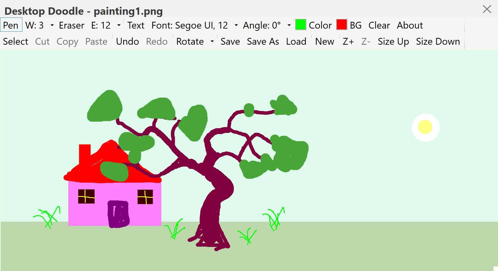
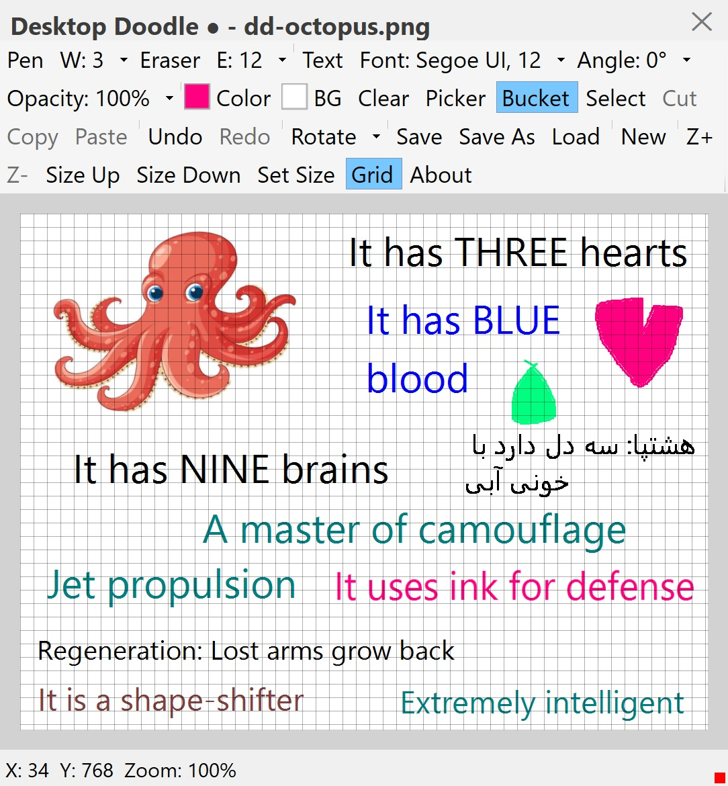
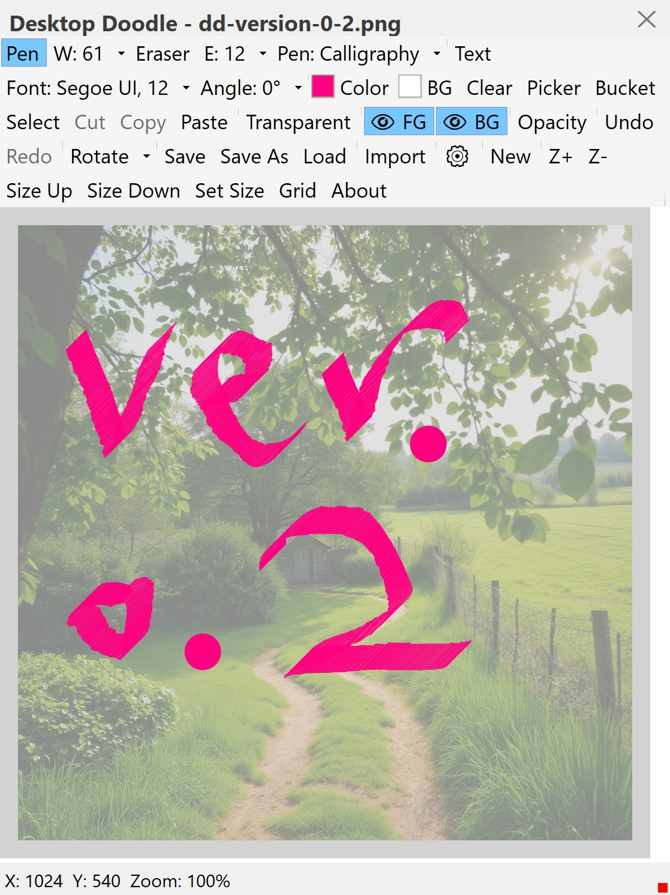
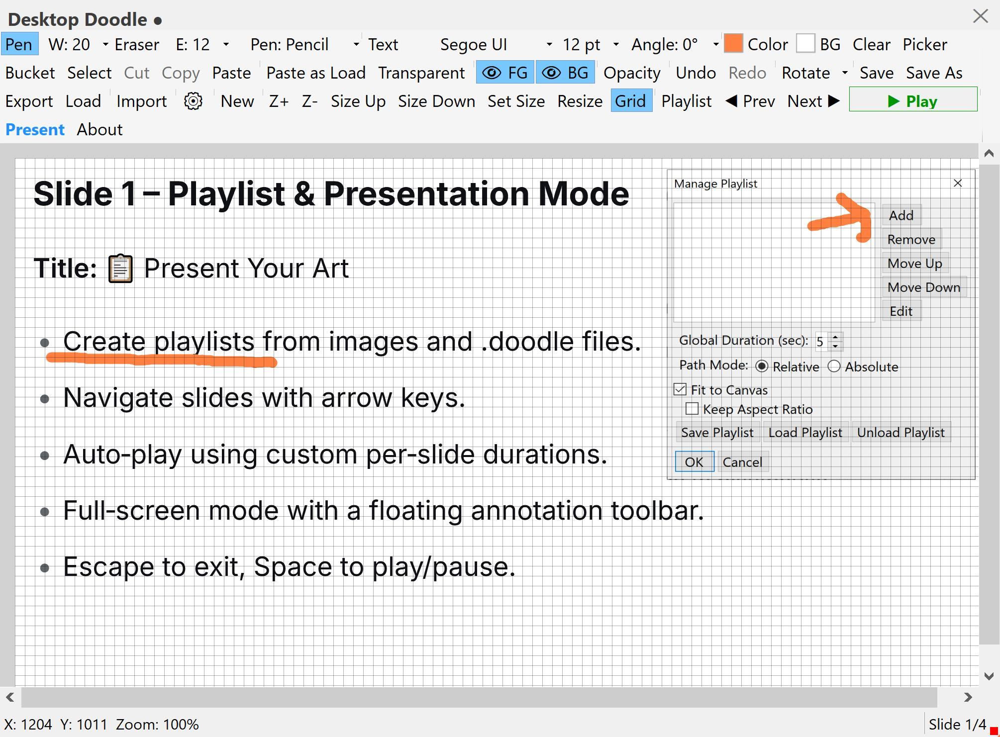
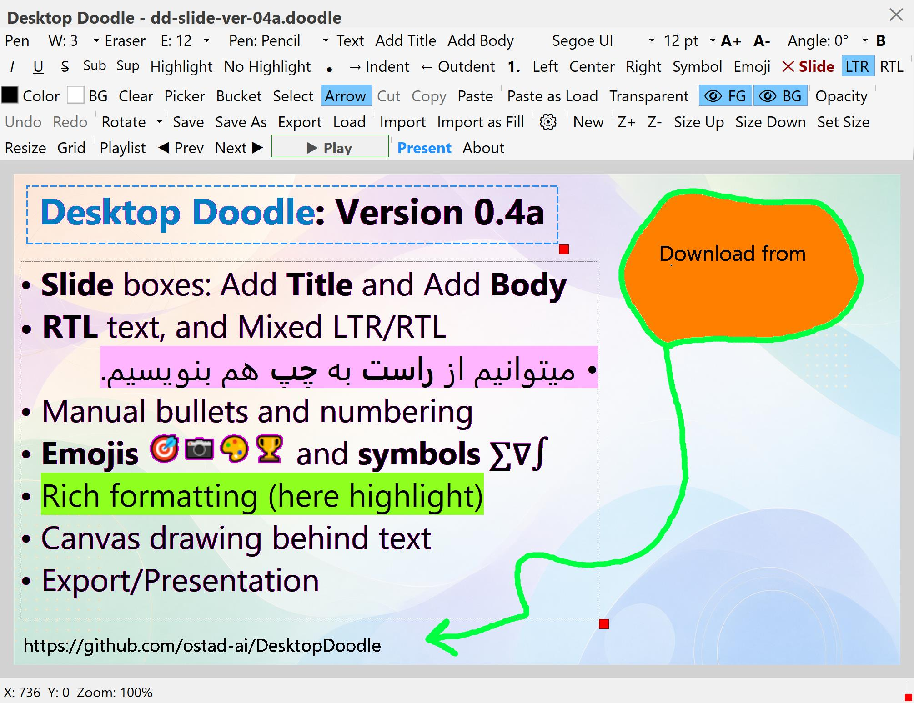
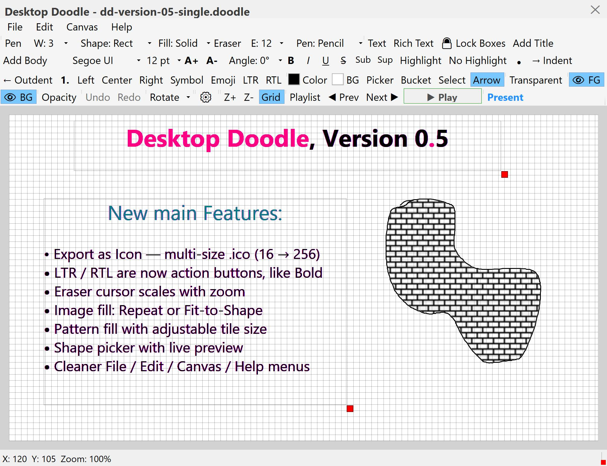

# Desktop Doodle 🎨🖌️
Desktop Doodle **0.5** sharpens the tools you already use and adds one long‑asked‑for export. The headline is a new **Export as Icon** command — File → Export as Icon... — that writes a proper Windows `.ico` with six sizes (16, 32, 48, 64, 128, 256), respecting the transparent‑background toggle and using the current selection (or trimming to content automatically). Text direction has been rebuilt: **LTR / RTL are now action buttons**, like Bold and Italic — they apply to the current paragraph and no longer flash the whole box on every edit. The **eraser cursor now scales with zoom**, matching the real eraser footprint, backed by an HICON cache that stays clean under rapid `Ctrl+wheel` zooming. Rounding out the release: shape picker with live preview, pattern and image fills (Repeat or Fit‑to‑Shape), transparent eraser with tolerance, and a tidier File / Edit / Canvas / Help menu.

 - If you have an older version of the app, update it to the latest version **0.5**.

**Desktop Doodle** is a lightweight, offline, always‑on‑top sketchpad for Windows — it floats above your work and stays out of your way.

Draw with pen or eraser. Type rich text in any language, including RTL. Insert emojis and symbols. Drop in shapes, curves, and polygons. Work on two independent layers, each with its own opacity and visibility. Fill with solid color, patterns, or images. Then export as a flattened image, a multi‑size `.ico`, or a `.doodle` project you can revisit later.

Made for quick notes, live annotations, mockups, or just doodling over your desktop. Offline by design — no accounts, no cloud, no telemetry.

**Two drawing modes:**
- **Freehand** — click and drag, as always.
- **Straight line** — hold `Shift` while dragging. A dashed preview follows the cursor; on release, a solid straight line is drawn from the start point to the end point. Works with both **Pen** and **Eraser**.
---

<table>
  <tr>

<td>
Figure 1: A snapshot of the app: Desktop Doodle, version 0.0, while painting.</td>
    
<td>
Figure 2: A snapshot of the new version of the app: Desktop Doodle, version 0.1, while defining data pipeline.</td>

  </tr>
<tr>
<td>
Figure 3: A snapshot of the app: Desktop Doodle, version 0.2, while painting with lots of pens, two layers, and import.</td>

<td>
Figure 4: A snapshot of the app: Desktop Doodle, version 0.3, while showing the new presentation mode.</td>
</tr>
<tr>
<td>

Figure 5: A snapshot of the app: Desktop Doodle, version 0.4a, while showing the new slide creation tools.
</td>
<td>

Figure 6: A snapshot of the app: Desktop Doodle, version 0.5, while showing the new fill tools.
</td>
</tr>
</table>

---

## 🎉 What's New in Desktop Doodle 0.5

### 🖼️ Export as Icon — Native Multi-Size `.ico`
- New: **File → Export as Icon...**
- Writes a proper Windows `.ico` containing six sizes: **16, 32, 48, 64, 128, 256**.
- Uses the **current selection** as the icon source, or **trims to content automatically** when nothing is selected.
- Respects the **transparent-background toggle** — PNG frames with full alpha.
- Letterboxes rectangular canvases into a square icon without distortion.

### 🔤 Text Direction — Refined
- **LTR / RTL are now action buttons**, like Bold and Italic — they apply to the current paragraph and keep no toggled state.
- Removed the control-level `RightToLeft` flash that briefly flipped text on every re-entry into edit mode.
- Per-paragraph direction is stored in the RTF (`\rtlpar` / `\ltrpar`) and survives commit, undo, and reload.

### 🖌️ Eraser Cursor Scales with Zoom
- The eraser cursor square now **grows and shrinks with the canvas zoom**, matching the actual eraser footprint.
- Backed by an HICON cache with deferred cleanup, so rapid `Ctrl+wheel` zooming doesn't leak GDI handles.

### ✏️ Shapes & Fill
- **26 Paint-style shapes** plus free **Polygon** and **Curve**.
- Shape picker dialog with live preview.
- **Pattern fill** with adjustable tile size.
- **Image fill: Repeat or Fit-to-Shape**.
- **Transparent eraser mode** with tolerance.

### 🖱️ Canvas & Navigation
- **Pinch-to-zoom** on touchpads.
- **Save Selection As** — export the current selection as an image.
- Cleaner, more consistent menu system: **File / Edit / Canvas / Help**.

### 🐞 Stability & Polish
- Many small bug fixes carried over from 0.4 feedback.

---

## 🎉 What’s New in Desktop Doodle 0.4

### 🧾 Slide Text Boxes – A New Level of Rich Text
- Add draggable, resizable text boxes directly on the canvas.
- Full rich text support:
  - Bold, italic, underline, strikeout
  - Font family, font size, text color, highlight color
  - Subscript and superscript
  - Alignment: left, center, right
  - Manual bullets and numbering
- Full **RTL** support for Persian, Arabic, and other right‑to‑left languages.
- Text scales automatically with canvas zoom.

### 😀 Emoji & Symbol Insertion
- Colorful emoji picker with true DirectWrite color rendering.
- Emojis inserted as scalable images inside text boxes.
- Symbol picker with Greek, math, arrows, and common symbols.
- Custom input field: type any character or `U+code` to insert.

### ✂️ Editing & Navigation
- Cut / Copy / Paste for both slide text boxes and the old text tool.
- Independent Undo / Redo for text edits.
- Keyboard shortcuts:
  - `Ctrl+]` / `Ctrl+[` — increase / decrease font size.
  - `Ctrl+Enter` — commit slide text editing.
  - `Escape` — cancel editing.
  - Arrow keys — move selected text box.
- Toolbar font controls now update to match the current selection/caret.

### 🐞 Stability & Performance
- Fixed bucket tool flood fill for both layers.
- Fixed RTL paragraph formatting without losing character styles.
- Fixed emoji rendering and scaling.
- Improved slide text box copy/paste workflow.
- Many small polish and bug fixes.

### 🖼️ Dialogs & UI
- New About dialog with version info.
- Redesigned Symbol and Emoji pickers with larger buttons and custom insertion.
- Better scrollbar behavior when loading projects.

## 🆕 What's New in Version 0.3

- **📋 Playlist & Presentation Mode** – Create slideshows from images and `.doodle` files. Navigate with keyboard arrows, auto‑play with custom durations, and present full‑screen.
- **🎨 Live Annotation Tools** – While presenting, draw with a pen, erase, change colours and sizes, and save your marks permanently back to the canvas.
- **🎯 Pointer Tool** – A neutral cursor for pointing at slide details without accidentally drawing.
- **💾 Layered Save/Load** – New `.doodle` project format preserves both foreground and background layers, their opacities, and canvas settings.
- **🖼️ Fit to Canvas & Keep Aspect Ratio** – Scale slides to fill the window, with or without preserving proportions.
- **🧠 Smart Resize with Skew** – Non‑uniform scaling that fits the canvas perfectly after a shear transformation.
- **🔒 Rock‑Solid Toolbar** – Dynamic‑width buttons (pen size, eraser size, pen type, font, angle) are locked in place; the toolbar no longer shifts or causes scrollbar ghosts.
- **🗂️ Playlist Management** – Add, reorder, edit titles, set per‑slide durations, and save/load `.ddplaylist` files.
- **⌨️ Presentation Shortcuts** – Arrow keys to change slides, Space to play/stop, Escape to exit full‑screen.

## ✨ What's New in Version 0.2

- 🖊️ **12 Professional Pens** – Pencil, Calligraphy, Highlighter, Pixel, Airbrush, Chalk, Watercolor, Glitter, Ink, Pattern, Smudge, and Eraser – all refined and polished.
- 📋 **Improved Clipboard** – Copy and paste with external apps (Paint, etc.) while preserving transparency.
- 🎯 **Selection Tools** – Select All (`Ctrl+A`) and Content-Aware Selection (`Ctrl+Shift+A`).
- 📐 **Layer Enhancements** – Foreground/Background layers with opacity controls.
- ⚡ **Performance** – Zoom cache improvements for smoother drawing.
- 🧽 **Enhanced Eraser** – Works seamlessly on both layers (transparent on foreground, solid on background).
- 🔄 **Undo/Redo** – Fully layer-aware for all drawing and editing actions.
- 🚀 **Single-File Publish** – No extra DLLs; everything is embedded in one `.exe`.

---

## 🎨 Features

### 🖊️ Drawing Tools

| Pen | Description |
|-----|-------------|
| **Pencil** | Classic, smooth, everyday sketching. |
| **Calligraphy** | Elegant, angle‑sensitive strokes. |
| **Highlighter** | Soft, translucent, semi‑transparent. |
| **Pixel** | Retro, crisp, blocky pixel art. |
| **Airbrush** | Soft, misty, spray‑style. |
| **Chalk** | Dusty, organic, textured. |
| **Watercolor** | Fluid, blooming, fading gently. |
| **Glitter** | Sparkly, playful, shimmering. |
| **Ink** | Speed‑sensitive, flowing fountain pen style. |
| **Pattern** | Motifs: Circle, Star, Heart, Spiral, Triweave, Petal. |
| **Smudge** | Soft, blending, finger‑painting style. |
| **Eraser** | Clears to transparency or canvas colour. |

### 🎯 Selection & Editing

- **Select, Move, Resize, Rotate** – Full control over selections.
- **Cut, Copy, Paste** – With transparency support.
- **Select All** – `Ctrl+A` selects the entire canvas.
- **Content-Aware Selection** – `Ctrl+Shift+A` selects only painted pixels.
- **Arrow Keys** – Move selection by 1px (`Shift+Arrow` = 10px).
- **Delete** – Clears selection content.

### 📐 Layers

- **Foreground Layer** – Transparent by default, for main drawing.
- **Background Layer** – Solid colour, for canvas texture.
- **Visibility Toggles** – Show/hide each layer.
- **Opacity Controls** – Independent sliders for each layer.

### 🔄 Undo / Redo

- Fully layer‑aware.
- Supports all drawing and editing actions.
- Keyboard shortcuts: `Ctrl+Z` / `Ctrl+Y`.

### 🖼️ File Support

| Format | Save | Load | Import |
|--------|------|------|--------|
| PNG    | ✅   | ✅   | ✅     |
| JPEG   | ✅   | ✅   | ✅     |
| BMP    | ✅   | ✅   | ✅     |
| GIF    | ✅   | ✅   | ✅     |
| TIFF   | ✅   | ✅   | ✅     |
| SVG    | ❌   | ❌   | ✅     |

### 🖥️ UI Features

- **Custom Title Bar** – Drag to move, close button.
- **Tray Icon** – Show, New, Clear, Save, Exit.
- **Floating Panels** – Pen Settings and Layer Opacity.
- **Zoom / Pan** – Smooth and stable.
- **Grid** – Toggle on/off.
- **Status Bar** – Shows cursor position and zoom level.

---

## ⌨️ Keyboard Shortcuts

### File
| Shortcut | Action |
|----------|--------|
| `Ctrl+N` | New Canvas |
| `Ctrl+O` | Load Image / Project |
| `Ctrl+S` | Save Project |
| `Ctrl+Shift+S` | Save As |
| `Ctrl+W` | Close to Tray |
| `Alt+F4` | Exit |
| `F1` | User Guide |
| `F12` | About |

### Edit
| Shortcut | Action |
|----------|--------|
| `Ctrl+Z` | Undo |
| `Ctrl+Y` | Redo |
| `Ctrl+C` | Copy (selection / text) |
| `Ctrl+X` | Cut (selection / text) |
| `Ctrl+V` | Paste |
| `Ctrl+A` | Select All (canvas / text) |
| `Ctrl+Shift+A` | Select Content Bounds |
| `Delete` | Clear Selection — or Delete Active Slide Text Box |
| `Escape` | Clear Selection / Deselect Slide Box / Cancel Text Editing |

### Selection
| Shortcut | Action |
|----------|--------|
| `Ctrl+Shift+F` | Float Selection |
| `Arrow Keys` | Move Selection (1 px) |
| `Shift+Arrow` | Move Selection (10 px) |
| `Ctrl+Arrow` | Rotate Selection (5°) |
| `Ctrl+R` | Rotate Selection (90°) |

### Canvas
| Shortcut | Action |
|----------|--------|
| `Ctrl++` | Size Up |
| `Ctrl+-` | Size Down |

### Slide Text & Rich Text
| Shortcut | Action |
|----------|--------|
| `Ctrl+Enter` | Commit Editing |
| `Escape` | Cancel Editing |
| `Ctrl+]` | Increase Font Size |
| `Ctrl+[` | Decrease Font Size |
| `Arrow Keys` | Move Active Slide Text Box (1 px) |
| `Shift+Arrow` | Move Active Slide Text Box (10 px) |

### Legacy Text Tool
| Shortcut | Action |
|----------|--------|
| `Ctrl+Enter` | Commit |
| `Escape` | Cancel |

### Polygon & Curve
| Shortcut | Action |
|----------|--------|
| `Enter` | Commit Polygon / Curve (Polygon needs ≥ 3 vertices; Curve needs end point placed) |
| `Escape` | Cancel Polygon / Curve |
| Right-click | Commit Polygon (≥ 3 vertices) / Cancel Curve |

> **Note:**
> - `Ctrl+Z` / `Ctrl+Y` inside text editors affect only the text, not the canvas.
> - Arrow keys move the selected slide text box when it is **not** in edit mode.
> - `Escape` closes the active text editor or clears the selection, depending on context.

---

## 🖱️ Mouse Actions

### Drawing
| Action | Result |
|--------|--------|
| Left-drag on canvas | Draw (Pen) / Erase (Eraser) |
| `Shift` + left-drag | Straight line (dashed preview → solid on release) |

### Selection
| Action | Result |
|--------|--------|
| Left-drag on empty canvas (Select tool) | Start a new rectangular selection |
| Left-drag inside selection | Move the selection |
| Left-drag on a resize handle | Resize the selection |
| Left-drag on the green rotation handle | Rotate the selection |
| Click outside selection | Clear selection |

### Polygon & Curve
| Action | Result |
|--------|--------|
| Left-click (Polygon) | Add a vertex |
| Right-click (Polygon) | Commit (≥ 3 vertices) or cancel |
| Left-click (Curve) | Place start → end → control point |
| Right-click (Curve) | Cancel |

### Text Boxes — Move & Resize
| Tool | Action | Result |
|------|--------|--------|
| **Legacy Text** | Right-drag on the box | Move the box |
| **Legacy Text** | Left-drag the red grip | Resize |
| **Persistent Slide Text** | Left-drag the **border** | Move the box (ghost drag) |
| **Persistent Slide Text** | Left-click the body | Select / activate |
| **Persistent Slide Text** | Double-click the box | Enter edit mode |
| **Persistent Slide Text** | Left-drag the red grip | Resize |
| **Transient Rich Text** | Right-drag inside the editor | Move the box (ghost drag) |

### Other
| Action | Result |
|--------|--------|
| Right-click with Picker tool | Pick background color (left-click picks pen color) |
| `Ctrl` + mouse wheel | Zoom in / out |
| Pinch on touchpad | Zoom in / out |

---

## This archive includes the executable program: **DesktopDoodle.exe**, which is suitable for **Windows 10** and over. You should click on the executable to run.
[Download the archive for win64](https://drive.google.com/file/d/1skyltUSh0moKGPjYO6fmMFmpZlZn5cuP/view?usp=sharing)
---
